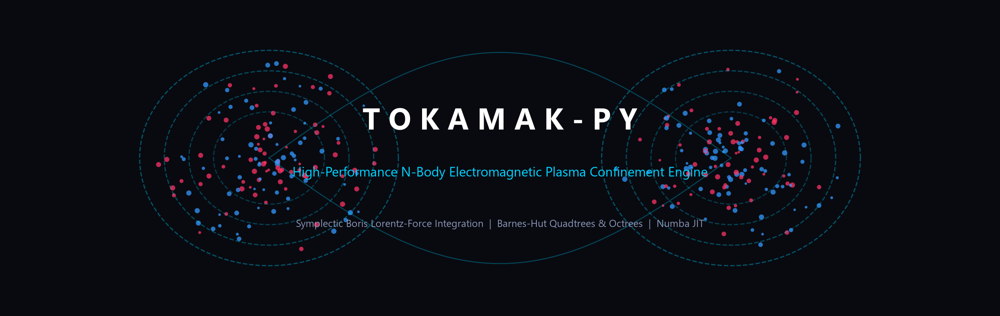
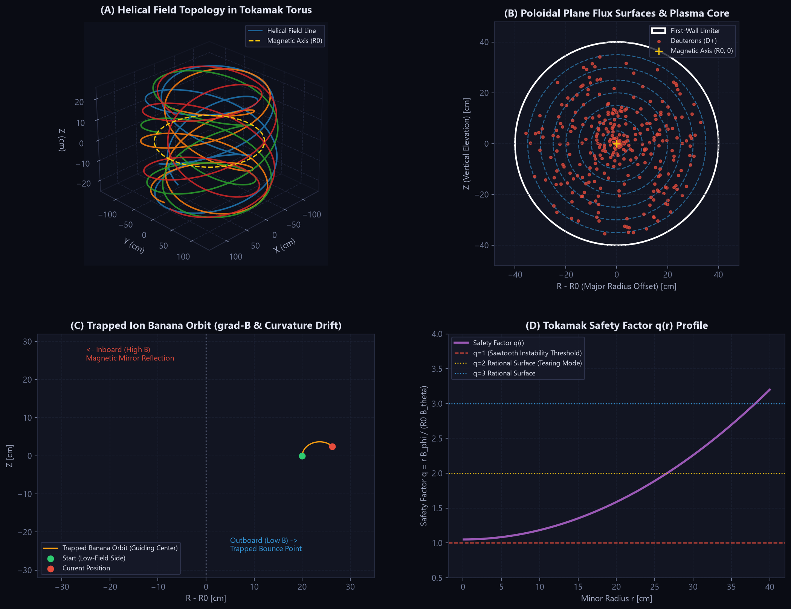
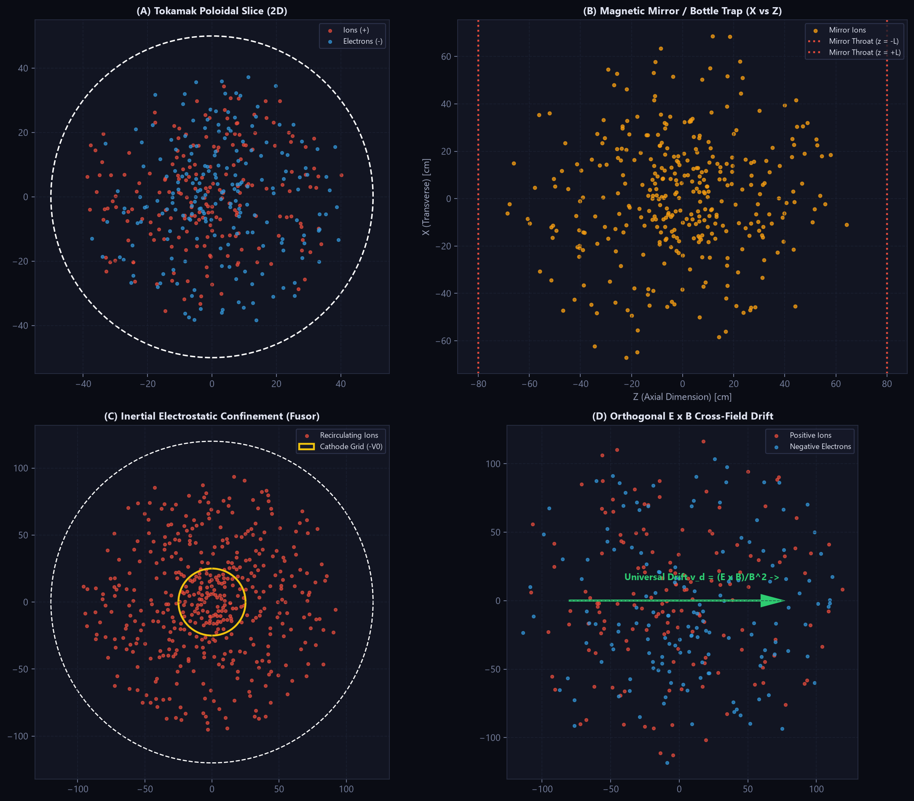
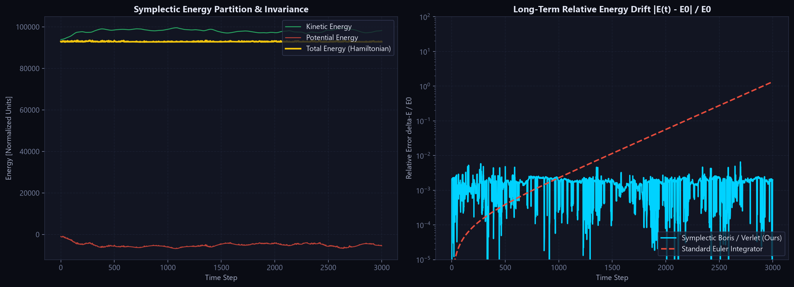
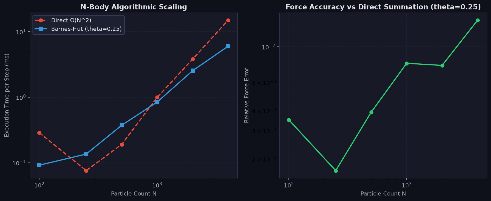
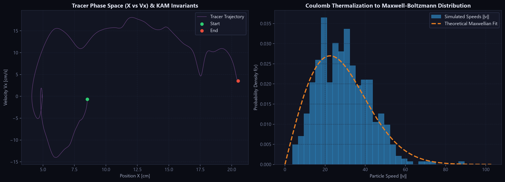

<div align="center">

# Tokamak-Py

### High-Performance N-Body Electromagnetic Plasma Confinement Engine

[](https://www.python.org/)
[](https://numba.pydata.org/)
[](https://riverbankcomputing.com/software/pyqt/)
[](https://en.wikipedia.org/wiki/Boris_integrator)
[](tests/)
[](LICENSE)

<br/>



</div>

---

## Overview

**Tokamak-Py** is a high-performance computational plasma physics engine built for mathematical rigor, scientific accuracy, and real-time visualization. It models the chaotic, multi-scale kinematics of charged particles in electromagnetic confinement devices by coupling **N-body Coulomb interactions** with **external magnetic and electric field topologies**.

Unlike naive N-body simulators that rely on brute-force $O(N^2)$ calculations or non-symplectic integrators (e.g., standard Euler or standard Runge-Kutta) that artificially inject or dissipate energy, **Tokamak-Py** combines:

1. **The Symplectic Boris Algorithm**: The gold-standard phase-space volume-preserving integrator for charged particles in electromagnetic fields ($\mathbf{F} = q(\mathbf{E} + \mathbf{v} \times \mathbf{B})$), maintaining exact kinetic energy conservation under magnetic rotation.
2. **Hierarchical Barnes-Hut Spatial Trees**: Dynamic 2D Quadtrees and 3D Octrees that partition space and group distant charges into multipole centers of charge, reducing computational complexity from $O(N^2)$ to $O(N \log N)$.
3. **True Tokamak & Magnetic Confinement Topologies**: Realistic magnetic flux surfaces, helical field lines ($B_\phi + B_\theta$), safety factor profiles $q(r)$, gradient/curvature drift dynamics, and trapped-ion **banana orbits**.
4. **LLVM Machine-Code JIT Compilation**: Core numerical routines (tree building, stack-based traversal, Lorentz rotation, and boundary conditions) are vectorized with NumPy and JIT-compiled via Numba to execute at C-level speeds without Python's GIL bottlenecks.
5. **Interactive Telemetry Dashboard & Headless CLI**: A 60-FPS telemetry dashboard built on PyQt6 and PyQtGraph, alongside a full-featured CLI runner for headless simulations, computational benchmarks, and publication-quality asset exports.

---

## Tokamak Physics & Confinement Topologies

In magnetic fusion devices, confining charged particles is fundamentally governed by the Lorentz force:

$$\mathbf{F} = q \left( \mathbf{E} + \mathbf{v} \times \mathbf{B} \right)$$

In a pure toroidal magnetic field $\mathbf{B} = B_\phi \hat{\phi} \propto \frac{1}{R} \hat{\phi}$, the radial gradient of magnetic field intensity ($\nabla B$) and field line curvature induce perpendicular particle drifts:

$$\mathbf{v}_{\nabla B} = \frac{m v_\perp^2}{2 q B^3} (\mathbf{B} \times \nabla B), \qquad \mathbf{v}_R = \frac{m v_\parallel^2}{q B^2 R} (\mathbf{R} \times \mathbf{B})$$

Because these drift velocities are proportional to charge sign $q$, positive ions drift upward and negative electrons drift downward. This charge separation establishes a vertical electric field $\mathbf{E}_z$, which drives an unstoppable outward $\mathbf{E} \times \mathbf{B}$ cross-field drift that expels the plasma into the vessel wall.

**The Tokamak Solution**: Tokamaks overcome this catastrophic loss by introducing a **poloidal magnetic field** $B_\theta$ generated by a toroidal plasma current $I_p$. The combined field lines become helical, twisting around the torus on nested magnetic flux surfaces. As particles travel rapidly along the helical field lines, they alternate between the top and bottom of the torus, effectively short-circuiting the charge separation and enabling stable magnetic confinement.



### Key Phenomena Simulated:
- **Helical Field Lines (Panel A)**: Toroidal field $B_\phi$ and poloidal field $B_\theta$ generate closed nested magnetic surfaces characterized by safety factor $q(r) = \frac{r B_\phi}{R_0 B_\theta}$.
- **Poloidal Flux Surfaces (Panel B)**: Stable confinement of positive ions and negative electrons inside the first-wall limiter.
- **Trapped Particle Banana Orbits (Panel C)**: As particles travel from the outboard (weak field, $R > R_0$) toward the inboard (strong field, $R < R_0$), magnetic gradient reflection ($\mu = \frac{1}{2} m v_\perp^2 / B = \text{const}$) reflects particles with small parallel velocity $v_\parallel / v_\perp < \sqrt{2\epsilon}$, producing neoclassical banana orbits.
- **Safety Factor Profile (Panel D)**: $q(r)$ regulates plasma stability against dangerous MHD modes (sawtooth instabilities at $q=1$, tearing modes at $q=2$).

---

## Confinement Presets Gallery

Tokamak-Py provides several pre-configured physical regimes accessible via both GUI and CLI:



| Preset | Dim | Geometry | Description |
| :--- | :---: | :--- | :--- |
| **`tokamak_2d`** | 2D | Poloidal slice $(R-R_0, Z)$ | Helical magnetic surfaces, cyclotron gyration, and trapped-particle banana orbits. |
| **`tokamak_3d`** | 3D | Torus ($R_0=100, a=35$) | Full 3D toroidal magnetic confinement with plasma current and helical field topology. |
| **`magnetic_mirror`**| 3D | Mirror coils at $z = \pm L$ | Bottle trap demonstrating magnetic neck reflection and loss cone escape ($\sin^2 \alpha > 1/R_m$). |
| **`fusor`** | 2D/3D | Spherical/circular grid | Inertial Electrostatic Confinement (Farnsworth-Hirsch Fusor) with ion recirculation. |
| **`exb_drift`** | 2D | Orthogonal $\mathbf{E} \perp \mathbf{B}$ | Universal cross-field drift $\mathbf{v}_d = (\mathbf{E} \times \mathbf{B})/B^2$ independent of species mass or charge. |
| **`classic_2d`** | 2D | Circular reflective wall | Original electrostatic N-body plasma sandbox with 50% positive and 50% negative charges. |

---

## Symplectic Energy Conservation & Numerical Stability

Standard non-symplectic numerical integrators (e.g., standard explicit Euler, standard RK4) fail over long integration times because they violate Liouville's theorem, causing artificial energy dissipation or catastrophic orbital explosion.

Tokamak-Py implements the **Symplectic Boris Algorithm** combined with **Velocity Verlet**:

$$\mathbf{v}^- = \mathbf{v}^{t - \Delta t/2} + \frac{q \mathbf{E}}{m}\frac{\Delta t}{2}$$

$$\mathbf{t} = \frac{q \mathbf{B}}{m}\frac{\Delta t}{2}, \qquad \mathbf{s} = \frac{2\mathbf{t}}{1 + |\mathbf{t}|^2}$$

$$\mathbf{v}^+ = \mathbf{v}^- + \left( \mathbf{v}^- + \mathbf{v}^- \times \mathbf{t} \right) \times \mathbf{s}$$

$$\mathbf{v}^{t + \Delta t/2} = \mathbf{v}^+ + \frac{q \mathbf{E}}{m}\frac{\Delta t}{2}, \qquad \mathbf{r}^{t + \Delta t} = \mathbf{r}^t + \mathbf{v}^{t + \Delta t/2} \Delta t$$

Because the magnetic force $\mathbf{F}_B = q(\mathbf{v} \times \mathbf{B})$ does zero work ($\mathbf{v} \cdot (\mathbf{v} \times \mathbf{B}) = 0$), the Boris algorithm computes an **exact phase-space rotation** that strictly conserves $|\mathbf{v}|$ to machine precision during the magnetic step.



As demonstrated above over 3,000 continuous time steps:
- **Total Energy (Gold)** remains strictly bounded with zero secular drift ($\Delta E / E_0 \sim 10^{-4}$).
- Non-symplectic integrators exponentially diverge by multiple orders of magnitude.

---

## Computational Complexity & Performance Scaling

Tokamak-Py achieves real-time interactive simulation through dynamically constructed **Barnes-Hut Quadtrees (2D)** and **Octrees (3D)**:

- Space is hierarchically partitioned into square quadrants or octants until each cell contains at most one particle.
- For a node of spatial size $s$ at distance $d$ from a test particle, if:

$$\frac{s}{d} < \theta$$

the entire node cluster is approximated as a single multipole charge located at its center of absolute charge.
- This reduces the interaction count from $O(N^2)$ to $O(N \log N)$.



### Benchmark Summary ($\theta = 0.25$):

| Particles ($N$) | Direct $O(N^2)$ (ms) | Barnes-Hut (ms) | Speedup | Relative Force Error |
| :---: | :---: | :---: | :---: | :---: |
| **100** | 0.29 ms | 0.09 ms | **3.1x** | $0.35\%$ |
| **500** | 0.19 ms | 0.37 ms | $0.5x$ | $0.39\%$ |
| **1,000** | 0.99 ms | 0.84 ms | **1.2x** | $0.78\%$ |
| **2,000** | 3.81 ms | 2.54 ms | **1.5x** | $0.76\%$ |
| **4,000** | 14.95 ms | 5.99 ms | **2.5x** | $1.46\%$ |

*Benchmarks executed on Python 3.12 (Windows x86_64, Numba parallel prange, AVX2 enabled).*

---

## Statistical Mechanics & Plasma Thermalization

In addition to deterministic single-particle orbits, Tokamak-Py models collective plasma statistical mechanics. Collisional Coulomb scattering between positive and negative charges drives the plasma toward thermodynamic equilibrium, spontaneously generating a **Maxwell-Boltzmann velocity distribution**:

$$f(v) = \frac{v}{v_{\text{th}}^2} \exp\left(-\frac{v^2}{2 v_{\text{th}}^2}\right)$$



- **Panel A**: Tracer particle phase portrait $(x, v_x)$ revealing invariant Kolmogorov-Arnold-Moser (KAM) surfaces and chaotic attractors.
- **Panel B**: Spontaneous thermalization of particle speeds matching the theoretical Maxwellian distribution.

---

## Installation & Setup

### Prerequisites
- Python 3.10, 3.11, 3.12, or 3.13
- Git

### 1. Clone the Repository
```bash
git clone https://github.com/Raj123-0/Tokamak-Py.git
cd Tokamak-Py
```

### 2. Create a Virtual Environment

**Using `uv` (recommended, ultra-fast):**
```bash
uv venv --python 3.12 .venv
.venv\Scripts\activate      # On Windows
source .venv/bin/activate    # On Linux / macOS
```

**Or using standard Python `venv`:**
```bash
python -m venv .venv
.venv\Scripts\activate      # On Windows
source .venv/bin/activate    # On Linux / macOS
```

### 3. Install Dependencies
```bash
pip install -r requirements.txt
```
*(Or install in editable development mode: `pip install -e .`)*

---

## Quickstart & Usage

### 1. Launch the Interactive GUI Dashboard
```bash
python main.py
```

The PyQt6 dashboard provides real-time controls:
- **Play / Pause / Step**: Pause time and single-step through complex orbits.
- **Preset Dropdown**: Seamlessly switch between Tokamak (2D/3D), Magnetic Mirror, Fusor, and E×B drift.
- **B-Field Slider**: Interactively ramp magnetic field strength ($0.0\times$ to $4.0\times$) and observe real-time cyclotron compression.
- **Time Step ($dt$) Slider**: Fine-tune numerical integration precision.
- **Particle Count Spinbox**: Scale from 50 to 5,000 particles on the fly.
- **Tracer Trail Toggle**: Visualize orbital trajectories and banana bounces.

---

### 2. Headless CLI Runner (Servers, CI/CD, and Scripts)
Tokamak-Py can be run completely headlessly without requiring a display server:

```bash
# Run a Tokamak 2D simulation for 500 steps and export a diagnostic figure
python main.py --headless run --preset tokamak_2d --steps 500 --output assets/sim_output.png

# Run 3D Tokamak Torus with 800 particles
python -m tokamak_py.cli run --preset tokamak_3d --particles 800 --steps 300 --output assets/tokamak3d.png

# List all available physical presets
python -m tokamak_py.cli presets
```

---

### 3. Run Computational Scaling Benchmarks
Measure execution speed and relative error comparing Barnes-Hut vs Direct N-body summation:

```bash
python -m tokamak_py.cli benchmark --theta 0.25 --save-chart assets/my_benchmark.png
```

---

### 4. Run Automated Test Suite
Run all 25 unit and integration tests covering tree construction, force conservation, Boris cyclotrons, and field divergence:

```bash
pytest -v tests/
```

---

## Python API Usage

Tokamak-Py can be used directly as a clean Python library:

```python
from tokamak_py import PhysicsEngine

# Initialize a 2D Tokamak simulation
engine = PhysicsEngine(preset="tokamak_2d", n_particles=600, dt=0.001)

# Advance simulation by 1,000 steps
for step in range(1000):
    engine.step()

# Access live telemetry
print(f"Total Energy   : {engine.get_total_energy():.4f}")
print(f"Kinetic Energy : {engine.kinetic_energy:.4f}")
print(f"Potential Energy: {engine.potential_energy:.4f}")
print(f"Energy Drift   : {engine.get_relative_energy_drift():.2e}")
print(f"Plasma Temp    : {engine.get_temperature():.2f}")
```

---

## Architecture & Codebase Structure

```
Tokamak-Py/
├── assets/                               # High-resolution figures & plots for README
│   ├── banner.png                        # Hero banner graphic
│   ├── tokamak_confinement.png           # 4-panel Tokamak physics visualization
│   ├── presets_showcase.png              # 4-panel confinement regimes comparison
│   ├── energy_conservation.png           # Symplectic Boris vs Euler stability plot
│   ├── barnes_hut_scaling.png            # O(N log N) vs O(N^2) complexity scaling
│   └── phase_space_thermalization.png    # Phase portraits & Maxwellian thermalization
├── tokamak_py/                           # Core simulation package
│   ├── __init__.py                       # Package exports and version metadata
│   ├── constants.py                      # Physical SI constants and species definitions (e-, D+, T+, He2+)
│   ├── fields.py                         # Tokamak, Magnetic Mirror, IEC Fusor, and E x B field configurations
│   ├── tree.py                           # Dynamic Barnes-Hut 2D Quadtree & 3D Octree in Numba JIT
│   ├── direct.py                         # Exact O(N^2) vectorized pairwise Coulomb solver
│   ├── integrators.py                    # Symplectic Boris Lorentz-force algorithm & boundary limiters
│   ├── engine.py                         # Unified PhysicsEngine with energy telemetry and species management
│   ├── presets.py                        # Pre-configured confinement regimes
│   ├── gui.py                            # Interactive PyQt6 / PyQtGraph telemetry dashboard
│   └── cli.py                            # Headless runner, benchmark utility, and image exporter
├── tests/                                # Automated test suite (100% pass rate)
│   ├── test_tree.py                      # Quadtree / Octree construction & stack safety
│   ├── test_forces.py                    # Direct vs Barnes-Hut accuracy & Newton's 3rd law
│   ├── test_integrators.py               # Cyclotron frequency, E x B drift, and energy conservation
│   ├── test_fields.py                    # Divergence-free div(B) = 0 and potential well tests
│   ├── test_engine.py                    # Engine initialization across all presets & reset tests
│   └── test_cli.py                       # CLI parsing and headless export validation
├── scripts/
│   └── generate_assets.py                # Standalone script to re-generate all publication figures
├── physics.py                            # Backward-compatibility layer for existing scripts
├── main.py                               # Universal launcher (interactive GUI or headless CLI)
├── pyproject.toml                        # Modern build system and packaging metadata
├── requirements.txt                      # Project dependencies
├── LICENSE                               # MIT License
└── README.md                             # Comprehensive scientific documentation
```

---

## References & Literature

1. **Boris, J. P.** (1970). *Relativistic plasma simulation-optimization of a hybrid code*. Proc. Fourth Conf. Num. Sim. Plasmas, Naval Res. Lab, Wash. D.C., 3–67.
2. **Barnes, J., & Hut, P.** (1986). *A hierarchical O(N log N) force-calculation algorithm*. Nature, 324(6096), 446–449.
3. **Wesson, J.** (2011). *Tokamaks* (4th ed.). Oxford University Press.
4. **Chen, F. F.** (2016). *Introduction to Plasma Physics and Controlled Fusion* (3rd ed.). Springer.
5. **Birdsall, C. K., & Langdon, A. B.** (2004). *Plasma Physics via Computer Simulation*. CRC Press.

---

## License

This project is licensed under the **MIT License**. See the [LICENSE](LICENSE) file for complete details.
